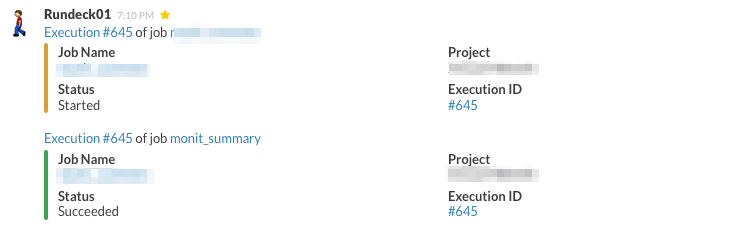
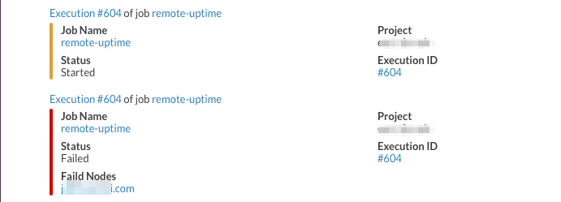

rundeck-team-incoming-webhook-plugin
====================================

Sends Rundeck job notification messages to a Microsoft Teams channel via a
Teams Incoming Webhook. Based on
[rundeck-slack-plugin](https://github.com/bitplaces/rundeck-slack-plugin)
and run-hipchat-plugin.

## Current release: 0.9.0-yeast-bloom

- **Microsoft Teams Workflows (Power Automate) webhooks are supported end to
  end** — the supported webhook type since Microsoft retired the Office 365
  Connectors format this plugin originally used (retirement completed
  2026-05-22; [issue #6](https://github.com/bageera/rundeck-team-webhook/issues/6)).
- Payload format auto-detection with a manual override (`Message Format`):
  Adaptive Card for Workflows, MessageCard for legacy connector URLs.
- HTTP-status-based success detection (`2xx` = delivered) — covers both the
  legacy connector `200` + `1` response and the Workflows `202 Accepted`
  empty-body response.
- Actionable HTTP 429 rate-limit errors (Teams allows roughly 4
  requests/second/webhook); response echoes in errors truncate to 200 chars.
- Security hardening: JSON-escaped message payloads (`?json_string`), no
  payload dumps in error logs, optional proxy support (no crash when unset),
  UTF-8 payload encoding, 10s connect/read timeouts.
- Modern build: Gradle 9.5.1 wrapper, Java 11 bytecode, FreeMarker 2.3.34.
- 14 unit tests (JUnit 5), run on every build; CI + CodeQL security scanning
  on GitHub Actions.
- Security policy with private disclosure: see [SECURITY.md](SECURITY.md)
  (security@nocturnalinc.com).

Full change history: [CHANGELOG.md](CHANGELOG.md).

## Upgrading: connector webhook -> Workflows webhook

If you are on <= 0.8.x with an old Office 365 Connector URL, the connector is
dead — Microsoft blocked it in May 2026. Create a Workflows webhook:

1. In Teams: **Workflows** app → choose the **"Send messages in Teams using
   incoming webhooks"** template (or build a flow around the **"When a Teams
   webhook request is received"** trigger).
2. Copy the generated URL (a `webhook.office.com` address).
3. Update the plugin jar in `$RDECK_BASE/libext` to 0.9.0-yeast-bloom.
4. In the Rundeck notification config, paste the new URL as `WebHook URL`.
   Leave `Message Format` on `auto` — nothing else to change.

Operator notes:

- Messages post as the Flow bot; bot icon/name customization is not available
  for webhook posts (Microsoft limitation, not the plugin's).
- The old screenshots below show MessageCard/connector cards. Adaptive Card
  output looks similar but flows through the Workflows bot.
- A Workflows webhook is tied to its flow owner; assign a co-owner in Power
  Automate so notifications don't stop if the owner leaves.

## Download jarfile

1. Download the jar from [releases](https://github.com/bageera/rundeck-team-webhook/releases).
2. Copy it to `$RDECK_BASE/libext`.
3. Restart Rundeck (or reload plugins) so the new version is picked up.

## Build

Requires a JDK (11+ works; the plugin targets Java 11 bytecode):

    ./gradlew clean build

The plugin jar lands in `build/libs/` (e.g.
`rundeck-team-webhook-0.9.0-yeast-bloom.jar`) and embedded libs in
`build/output/lib/`. The `rundeck-core` dependency is `compileOnly` — it is
provided by Rundeck at runtime and is not bundled into the plugin archive.
Unit tests run automatically as part of `build`; run them alone with
`./gradlew test`.

Install locally from source:

    cp build/libs/*.jar $RDECK_BASE/libext

## Configuration

- `WebHook URL` — Teams Incoming Webhook URL (required).
- `Message Format` — `auto` (default: Adaptive Card for `webhook.office.com`
  URLs, MessageCard otherwise), or pinned `adaptive` / `card`.

The webhook URL is a bearer credential for your channel — store it only in
Rundeck configuration, never in source control. See
[SECURITY.md](SECURITY.md) for the security policy (private reports:
security@nocturnalinc.com) and operator security notes.

## Message examples

Legacy connector MessageCard screenshots (Workflows Adaptive Card output is
similar), on success:

On failure:

## Proxy support

If Rundeck runs behind an HTTP proxy, the plugin honors the standard Java
system properties (set them in `$RDECK_BASE/etc/profile` / `rundeckd` java
options):

    -Dhttp.proxyHost=proxy.example.com -Dhttp.proxyPort=3128

Optional proxy authentication:

    -Dhttp.proxyUser=domain\\user -Dhttp.proxyPassword=secret

## Contributors

* Original [higanworks/rundeck-slack-incoming-webhook-plugin](https://github.com/higanworks/rundeck-slack-incoming-webhook-plugin) author: @sawanoboly
* Original [hbakkum/rundeck-hipchat-plugin](https://github.com/hbakkum/rundeck-hipchat-plugin) author: Hayden Bakkum @hbakkum
* Original [bitplaces/rundeck-slack-plugin](https://github.com/bitplaces/rundeck-slack-plugin) authors
  * @totallyunknown
  * @notandy
  * @lusis
* @sawanoboly