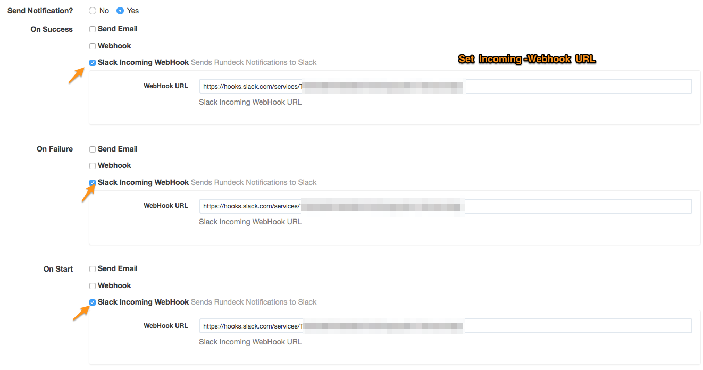

rundeck-team-incoming-webhook-plugin
====================================

Sends Rundeck job notification messages to a Microsoft Teams channel via a
Teams Incoming Webhook (Office 365 Connector). Based on
[rundeck-slack-plugin](https://github.com/bitplaces/rundeck-slack-plugin)
and run-hipchat-plugin.

Version 0.8.0 modernizes the build (Gradle 9 / Java 11 target), upgrades
FreeMarker to 2.3.34, and fixes several bugs (proxy NullPointerException,
UTF-8 payload encoding, JSON escaping in message templates).

Download jarfile
----------------

1. Download the jar from [releases](https://github.com/bageera/rundeck-team-webhook/releases).
2. Copy it to `$RDECK_BASE/libext`.
3. Restart Rundeck (or reload plugins) so the new version is picked up.

Build
-----

Requires a JDK (11+ works; the plugin targets Java 11 bytecode):

    ./gradlew clean build

The plugin jar lands in `build/libs/` and embedded libs in `build/output/lib/`.
The `rundeck-core` dependency is `compileOnly` — it is provided by Rundeck at
runtime and is not bundled into the plugin archive.

Install locally from source

    cp build/libs/*.jar $RDECK_BASE/libext

Configuration
-------------

This plugin uses Teams Incoming Webhooks. In the Teams channel, add an
"Incoming Webhook" connector, create one, and copy the URL it provides.

The only required configuration setting:

- `WebHook URL` — Teams Incoming Webhook URL.

Proxy support
-------------

If Rundeck runs behind an HTTP proxy, the plugin honors the standard Java
system properties (set them in `$RDECK_BASE/etc/profile` / `rundeckd` java
options):

    -Dhttp.proxyHost=proxy.example.com -Dhttp.proxyPort=3128

Optional proxy authentication:

    -Dhttp.proxyUser=domain\\user -Dhttp.proxyPassword=secret

Teams message example
---------------------

On success:

On failure:

Contributors
------------

* Original [higanworks/rundeck-slack-incoming-webhook-plugin](https://github.com/higanworks/rundeck-slack-incoming-webhook-plugin) author: @sawanoboly
* Original [hbakkum/rundeck-hipchat-plugin](https://github.com/hbakkum/rundeck-hipchat-plugin) author: Hayden Bakkum @hbakkum
* Original [bitplaces/rundeck-slack-plugin](https://github.com/bitplaces/rundeck-slack-plugin) authors
    * @totallyunknown
    * @notandy
    * @lusis
* @sawanoboly